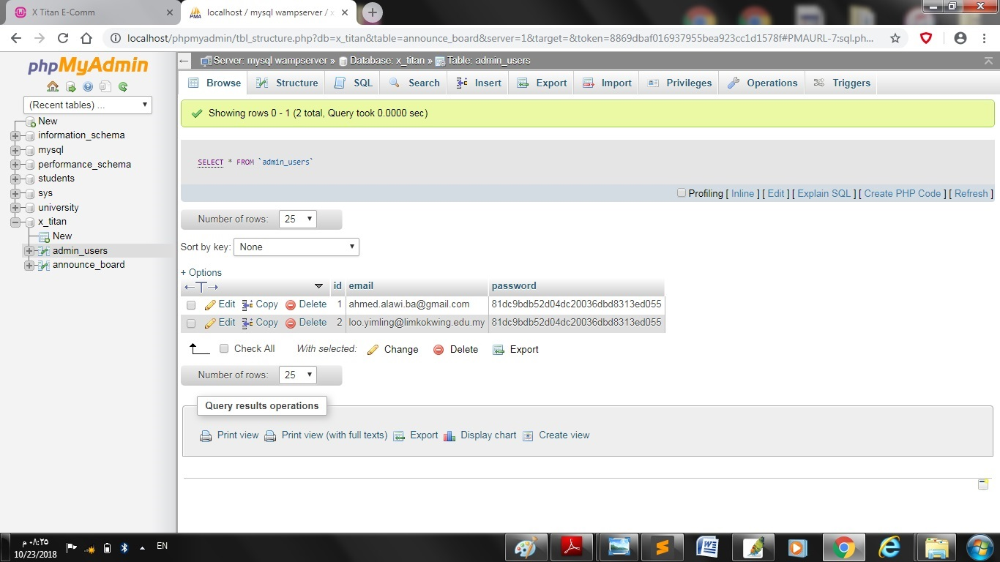
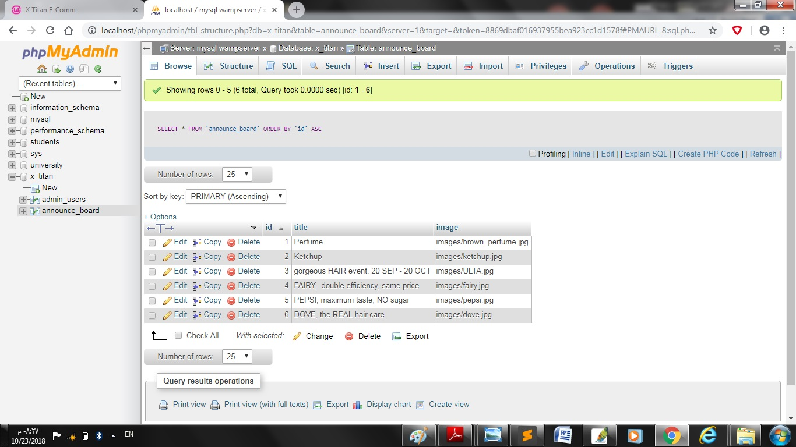

## E-Commerce website

 
This is an E-commerce website made by Html, Css, Javascript and PHP & Mysql in the back end and database. 

  

-------------------

<strong>to setup this project, you need to do the following steps:</strong>

- create a new database named 'x_titan', with admin name: 'root', and password: '1234'
 
- create the following tables, with the following columns and attributes: (admin_users: id int primary key, email varchar(100), password varchar(100)) , (announce_board: id int primary key, title varcahr(100), image varchar(100))

  

</a>
</a>
 

